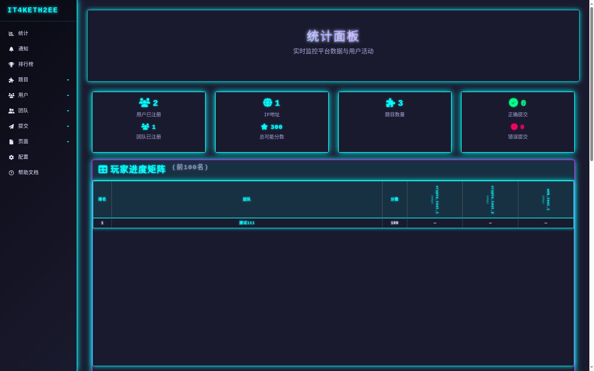
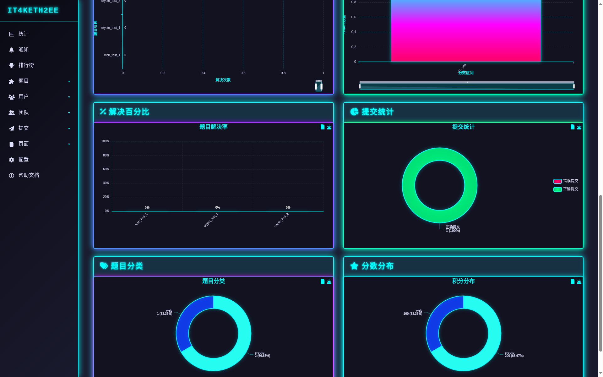
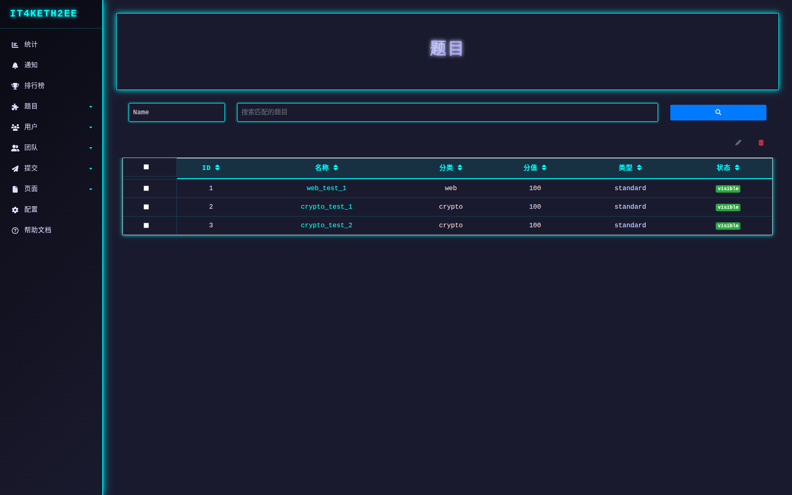
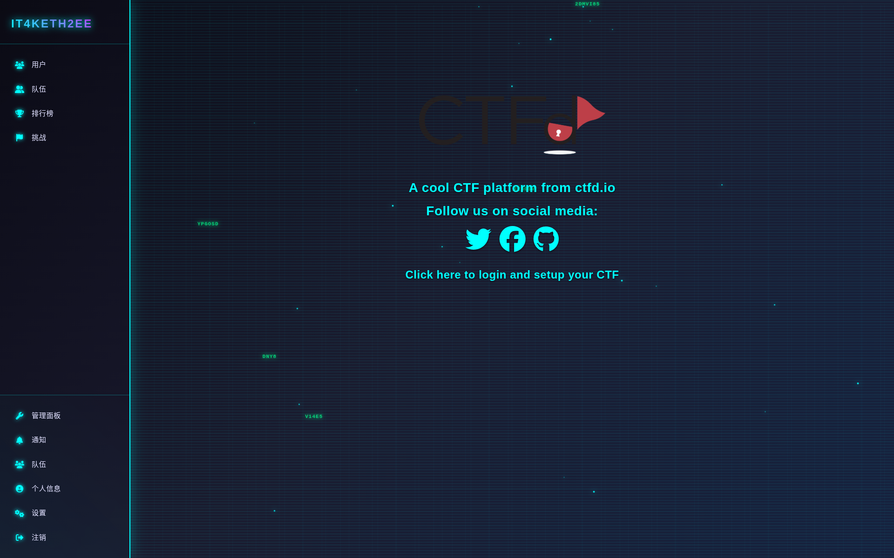
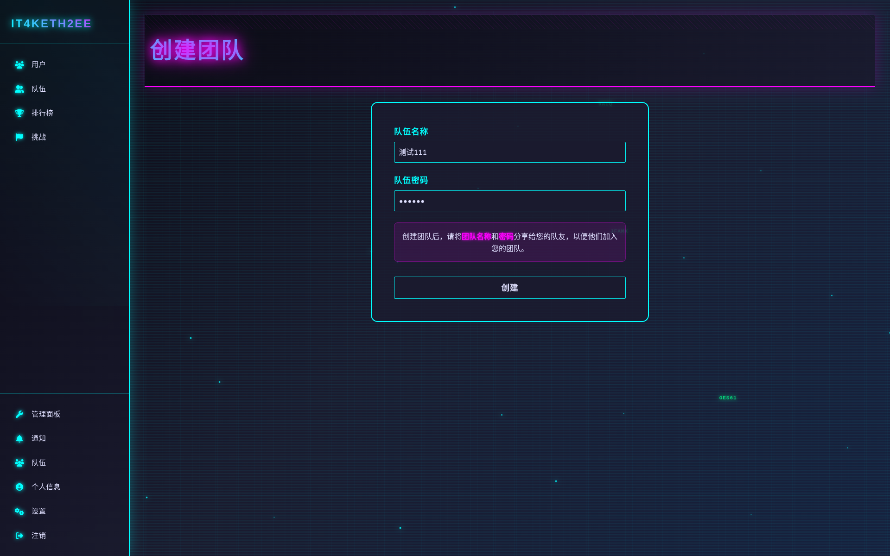
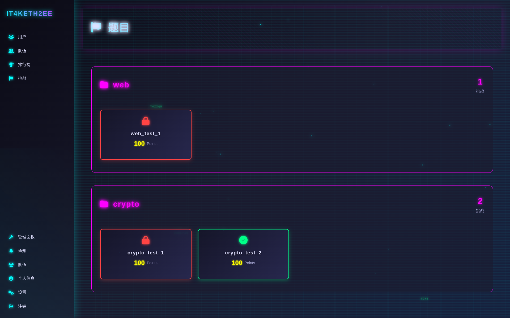
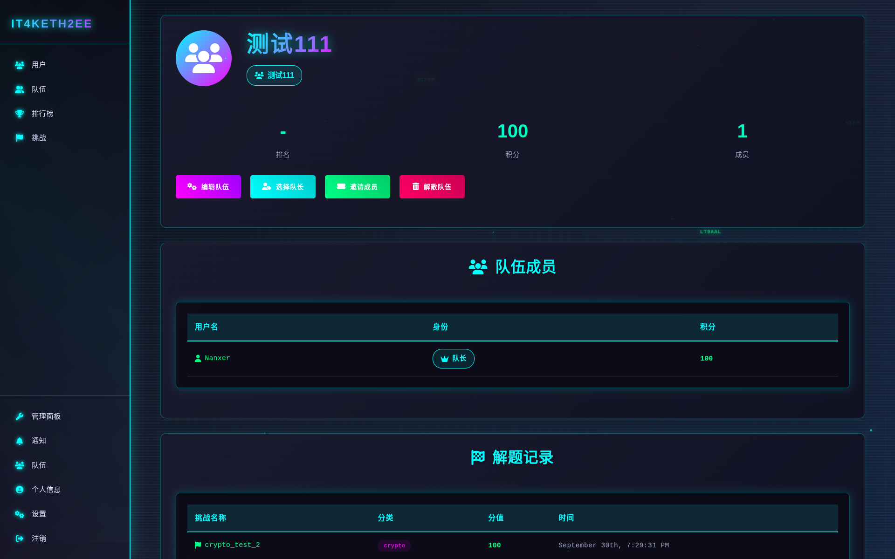
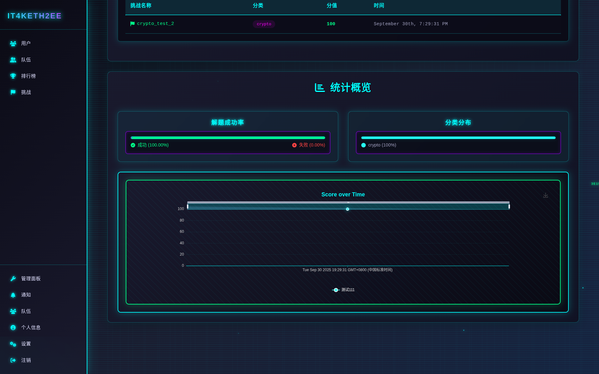
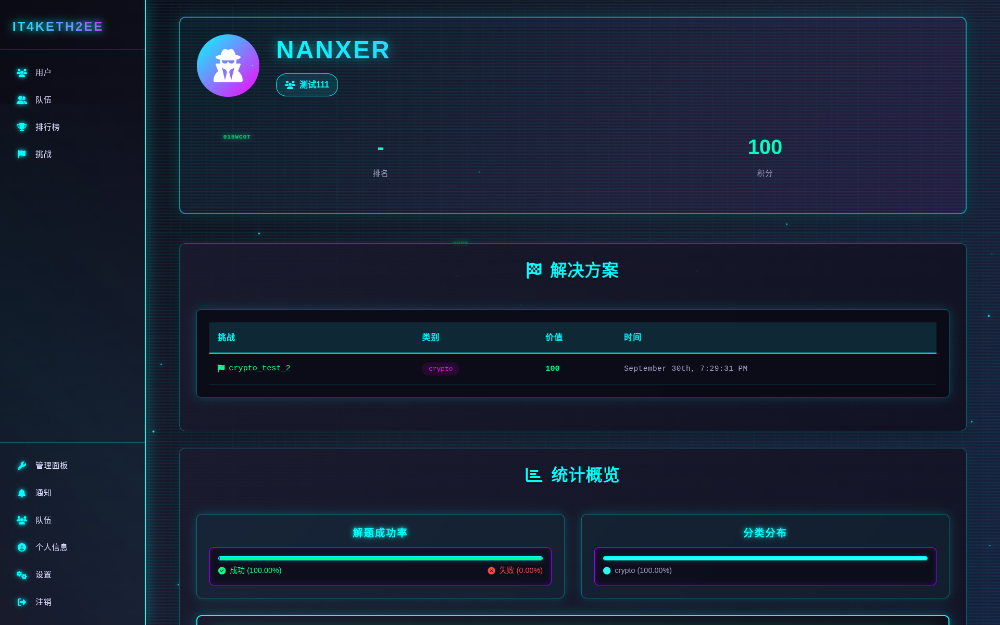
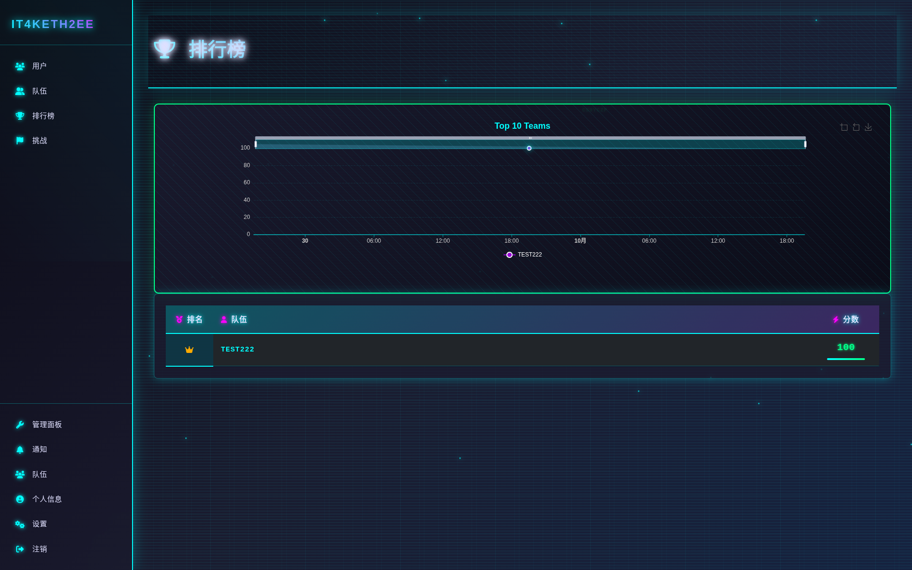

# CTFd-theme-it4keth2ee

一个现代化赛博朋克风格的CTFd主题，基于CTFd 3.8.0，在core基础上借助AI(Deepseek-V3.1)完成美化和部分汉化。

## 特性

- 🎨 **现代化赛博朋克风格** - 独特的视觉设计
- 🇨🇳 **中文界面优化** - 管理员界面和用户界面的汉化

## 快速开始

### 本地开发

```bash
# 安装依赖
yarn install

# 开发预览
yarn dev

# 构建生产版本
yarn build
```

## 界面预览

### admin 管理员界面

已经进行了大部分的汉化，但是由于部分页面是由一些组件代码临时生成的，汉化不绝对完全，不过基本够用。





### it4keth2ee 用户界面

现代化的赛博朋克风格用户界面。










## 使用说明

### 安装到CTFd

使用admin文件夹替换原有CTFd/CTFd/themes中的admin文件夹，并将it4keth2ee主题文件夹复制到CTFd的themes目录下，然后在CTFd管理后台选择该主题即可。

### 通知界面汉化

对于管理员页面通知界面的汉化，需要修改表单组件，参考修改：`CTFd/CTFd/forms/notifications.py`

```python
from wtforms import BooleanField, RadioField, StringField, TextAreaField
from wtforms.validators import InputRequired

from CTFd.forms import BaseForm
from CTFd.forms.fields import SubmitField


class NotificationForm(BaseForm):
    title = StringField("名称", description="通知标题")
    content = TextAreaField(
        "内容",
        description="通知内容。可以包含HTML和/或Markdown格式。",
    )
    type = RadioField(
        "通知类型",
        choices=[("toast", "Toast通知"), ("alert", "弹窗通知"), ("background", "后台通知")],
        default="toast",
        description="用户接收到的通知类型",
        validators=[InputRequired()],
    )
    sound = BooleanField(
        "播放声音",
        default=True,
        description="用户接收通知时播放声音",
    )
    submit = SubmitField("提交")
```

## 技术支持

使用中遇到问题或者想要优化改善，建议直接使用AI工具处理。

## 版权说明

### 许可证

本项目基于 [MIT 许可证](https://opensource.org/licenses/MIT) 开源。

### 使用条款

- ✅ **允许**：个人学习、教育用途、非商业项目使用
- ✅ **允许**：修改、分发、复制本主题
- ✅ **允许**：在遵守MIT协议的前提下进行二次开发
- ❌ **禁止**：用于商业盈利用途

### 免责声明

本主题基于CTFd核心主题开发，使用者需自行承担使用风险。作者不对因使用本主题导致的任何问题负责。